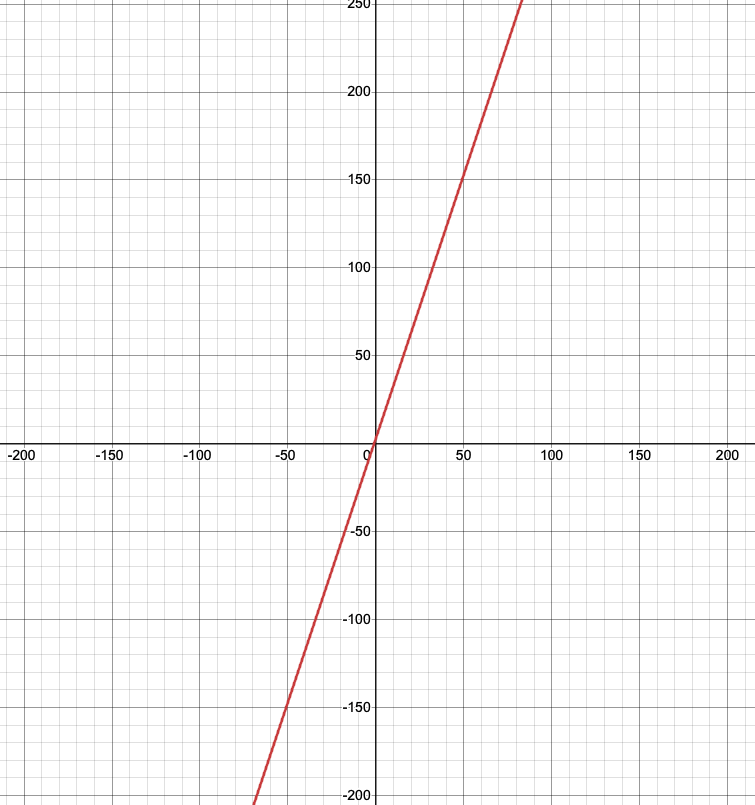
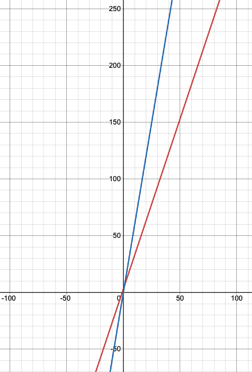
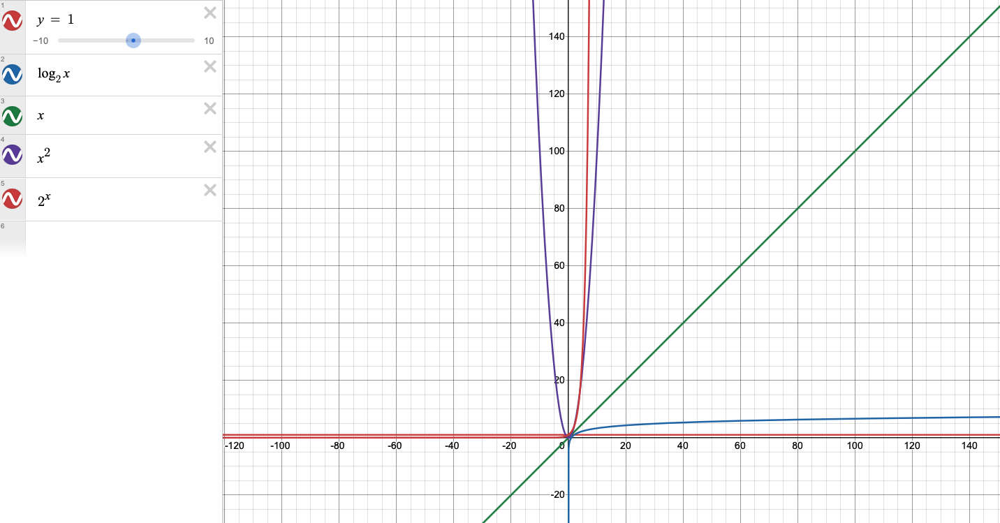

# Big O

Сложность алгоритмов может быть по времени и по памяти.  

**Сложность по времени** - сколько операций займет выполнение программы в зависимости от входных данных.  
**Сложность по памяти** - сколько памяти уйдет на выполнение программы в зависимости от входных данных  

**O** - это верхняя граница сложности алгоритмов входных данных.  

$f(x) = 3x + 3$



<br>

В функции x - это users

```python
f(users):
    // одна операция с переменной
    for x in users:  
        x.id = 10 
        x.name = 'test'
        x.last_name = 'test'
    
    batch() // <- одна операция
    commit()
    end()
```

$g(x)$ - это функция, которая "покрывает" функцию $f(x)$ - в любой точке оси x значение покрывающей функции больше, чем исходной функции



## Количество операций в зависимости от входных данных

|$n$ |$O(1)$|$O(log\ n)$|$O(n)$|$O(n^2)$|$O(2^n)$ |
|----|--------|--------|-------|--------|---------|
|10  |    1   |   ~4   |  10   |   100  |1024     |
|100 |    1   |   ~7   |  100  |  10000 |1.267e+30|
|1000|    1   |   ~10  |  1000 | 1000000| ...     |


$O(1)$ - вне зависимости от того, какие будут входные данные, функция всегда возвращает одно значение:
```python
f(arr): 
    return 10
```



При анализе сложности алгоритма считается, что нужно представлять, что _n_ стремиться к бесконечности. Абсолютно не важно, сколько операций в цикле, важно, что есть цикл. Таким образом в бесконечности $O(n^2)$ >> $O(n)$

```python
f(users):
    for u1 in users: // n
        for u2 in users: // n
            _
            _
    
    // n^2

    for u in users:
        _

    // + n

    commit()

    // +1
```

# Примеры

```python
# O(1)
f(n):
    for i = 0; i++; i < 10:
        op   
```

```python
# O(n)
f(n):
    for i = 0; i++; i < 100*n:
        op   
        op   
        op   
```

```python
# O(n*m)
f(n, m):
    for i = 0; i++; i < n:
        for j = 0; j ++; j < m:
            ops
            ops
```

```python
# O(n + m)
f(n, m):
    for i = 0; i++; i < n:
        ops
        ops
   
    for j = 0; j++; j < m:
        ops
        ops
```

```python
# O(n^2)
f(n):
    for i = 0; i++; i < n:
        for j = i; j++; j < n:
            ops
            ops
```

Амортизационный анализ - средняя производительность операций в худшем случае, не смотря на то, что отдельные операции могут быть довольно дорогими.

|       | 1 | 2 | 3 | 4 | 5 | 6 | 7 | 8 | 9 | 10 | 11 | 12 | 13 | 14 | 15 | 16 |
|-------|---|---|---|---|---|---|---|---|---|----|----|----|----|----|----|----|
size    | 1 | 2 | 4 | 4 | 8 | 8 | 8 | 8 | 16| 16 | 16 | 16 | 16 | 16 | 16 | 16 |
cost    | 1 | 2 | 3 | 1 | 5 | 1 | 1 | 1 | 9 | 1  |  1 |  1 |  1 |  1 |  1 |  1 |

1 - вставка  
1 - копирование  


[>>> Назад <<<](../README.md)